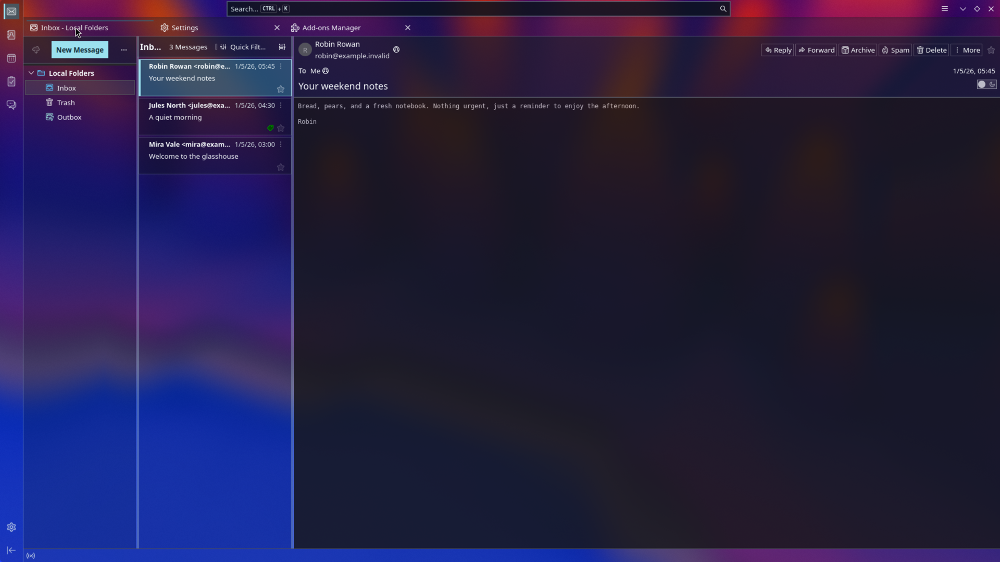
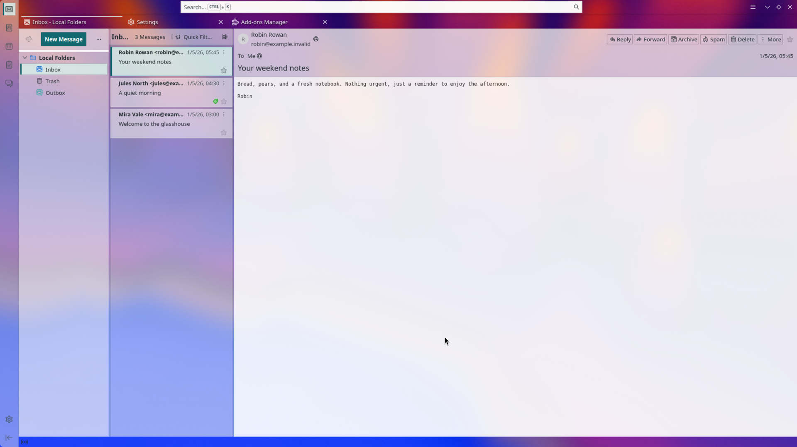
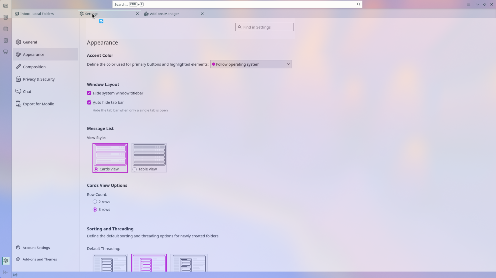
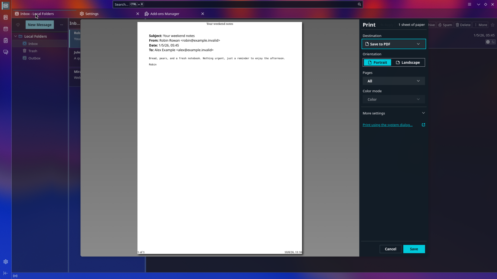
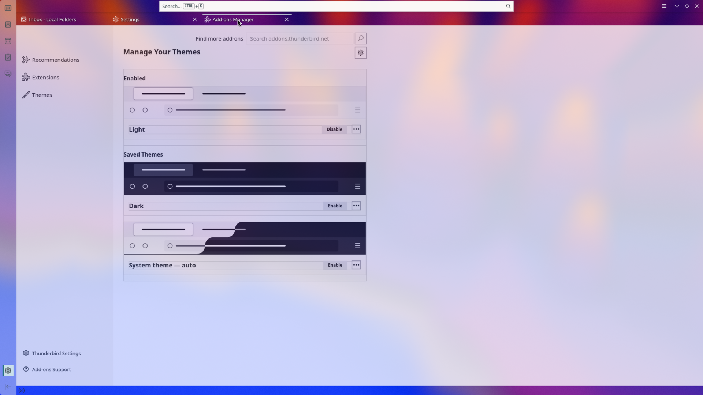
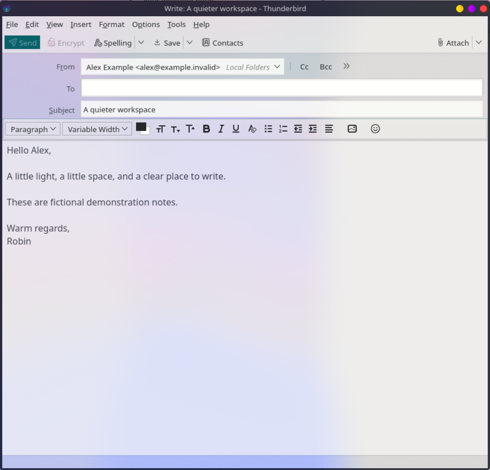

# Vesperwing Glass for Thunderbird

Transparent pearl and midnight surfaces, teal accents, readable inbox cards, and a clear toolbar/status bar. Built for Thunderbird 157 on Kubuntu / KDE Plasma. The extension delivers the full appearance without profile stylesheets. A backup-aware CSS installer is also available.

## Preview

These previews use a separate profile with fictional messages and no real accounts. The mail, light Settings, compose and print previews show the 0.2.0 refinement.

| Dark | Light |
|---|---|
|  |  |

| Settings | Print preview |
|---|---|
|  |  |

## Install the extension (recommended)

1. Build with `python3 build_extension.py`, or download the extension XPI from [Releases](https://github.com/sgerner/vesperwing-glass/releases).
2. Open **Add-ons and Themes → Extensions → gear → Install Add-on From File** and select `vesperwing-glass-extension-0.2.1.xpi`.
3. Review the unrestricted-access permission required by Thunderbird Experiments. The bundled implementation registers styles and identifies application tabs; it collects no data and does not read mail or contact the network.
4. New installations select Thunderbird's built-in **Dark** theme once. You can then choose **Light**, **Dark**, or another theme; updates and restarts preserve your choice. Configure KDE blur below.

Disable the extension to restore the native appearance. No advanced configuration preference is required. Tested on Thunderbird 157.0.1; other major versions are deliberately excluded.

### Migrating from profile CSS

Restore an installer-managed installation first using the command below. For manually installed Aurora/Vesperwing styles, quit Thunderbird, back up `chrome/userChrome.css` and `chrome/userContent.css`, and remove their glass imports. Preserve unrelated customizations. Set `toolkit.legacyUserProfileCustomizations.stylesheets` to `false` if no other profile styles need it, then restart. Avoid loading both copies of the design.

| Add-ons | Compose |
|---|---|
|  |  |

## Install with profile CSS (alternative)

Requires Python 3 and a local Thunderbird profile. No administrator privileges or Python dependencies are needed.

1. Download and extract **vesperwing-glass-1.0.0.zip** from [Releases](https://github.com/sgerner/vesperwing-glass/releases).
2. In Thunderbird, open **Help → Troubleshooting Information → Profile Folder → Open Folder**. Copy the profile directory path.
3. Quit Thunderbird completely, including other windows.
4. Open a terminal in the extracted directory and run:

   ```sh
   python3 install.py install --profile "/path/to/your/profile"
   ```

5. Start Thunderbird. Select the built-in **Light** or **Dark** theme under **Add-ons and Themes → Themes**. The customization follows that color scheme.

The installer copies two stylesheets, adds imports before your existing CSS, and enables `toolkit.legacyUserProfileCustomizations.stylesheets` in `user.js`. It saves the originals under `.vesperwing-glass/backups/` in your profile. Existing custom styles can still conflict; the installer preserves them rather than silently discarding them. It does not read or modify your mail or account configuration.

If you already installed the earlier Vesperwing/Aurora package, restore that installation first. To update this package, restore the previous installation, extract the new release, then install again.

### Kubuntu / KDE transparency

- Enable compositing and **Blur** in KDE **System Settings → Desktop Effects** (the exact category varies by Plasma version).
- KWin must provide a blur region for Thunderbird. If your setup needs a Force Blur effect/window rule, configure it separately; this installer does not install KWin plugins or rules.
- Keep whole-window opacity at **100%** so text and icons remain crisp. The CSS controls individual surface transparency.
- Try a softly colored wallpaper and adjust blur strength. Very saturated backgrounds will tint the glass.

Real blur is supplied by the compositor, not the stylesheet. Other desktops may show transparency without blur. Windows/macOS have not been verified; the CSS/installer may work, but matching compositor behavior is not promised.

## Restore

Quit Thunderbird and run:

```sh
python3 install.py restore --profile "/path/to/your/profile"
```

The installer restores original CSS and removes its managed `user.js` preference line. Backups remain available. If installed files were edited, it stops rather than overwriting them; after reviewing your edits, `--force` restores the saved originals.

Thunderbird may retain the enabled legacy stylesheet preference in `prefs.js` after removing the `user.js` line. To disable custom profile styles completely, set `toolkit.legacyUserProfileCustomizations.stylesheets` to `false` in **Settings → General → Config Editor**, provided your other customizations do not need it.

## Manual installation

With Thunderbird closed, back up your profile's existing `chrome/userChrome.css`, `chrome/userContent.css`, and `user.js`. Copy `styles/glass.css` and `styles/content.css` into its `chrome` directory. Add these imports at the **top** of the respective files:

```css
/* userChrome.css */
@import url("glass.css");
```

```css
/* userContent.css */
@import url("content.css");
```

Enable `toolkit.legacyUserProfileCustomizations.stylesheets` through Config Editor, then restart Thunderbird. Use the installer for automatic backup and restoration.

## Scope and accessibility

Covers the Spaces rail, folder tree, three-column message list/cards, message reader, toolbar, status bar, settings, add-ons, print controls, and separate compose window. Message/editor frame opacity affects local text and images as well as backgrounds; it does not change sent email. Printed output remains opaque. Native OS dialogs follow your desktop theme.

Reduced-transparency and forced-color rules provide more solid surfaces. Thunderbird's internal markup can change: **157 is the currently targeted version**, not a promise of compatibility with every release. Please include your Thunderbird version, desktop, color scheme and a sanitized screenshot when reporting a problem.

## Project files

- `install.py`: installer and restoration, Python standard library only.
- `styles/glass.css`: application chrome and compose-window styling.
- `styles/content.css`: settings, add-ons, print and editor content styling.
- `build_release.py`: creates the download archive.
- `docs/extension-feasibility.md`: Experiment permissions and submission notes.
- `docs/runtime-test.md`: verified behavior and remaining acceptance gaps.

## License

[0BSD](LICENSE): use, modify and redistribute freely, including commercially. Thunderbird and KDE names belong to their respective owners.

## Extension status

Version 0.2.0 was exercised with legacy stylesheet loading disabled: light/dark mail, translucent Settings/Add-ons, separate light compose editing and opaque print paper. See [runtime checks and remaining gaps](docs/runtime-test.md). This uses a privileged Experiment and requires manual Thunderbird Add-ons review; it has not been submitted or approved there.

### Light glass and color backdrops

Version 0.2.1 adds a translucent teal/lilac/blue base wash to Light mode, coordinated light title/status bars, and a lighter message canvas (54% reader-frame opacity with an 18% surface underneath). It supplies some color over a black window without installing a separate theme. The real desktop backdrop still influences the result. Dark surfaces retain their existing palette. Switch tracks and thumbs use square edges, with opaque white thumbs for clear state visibility.
